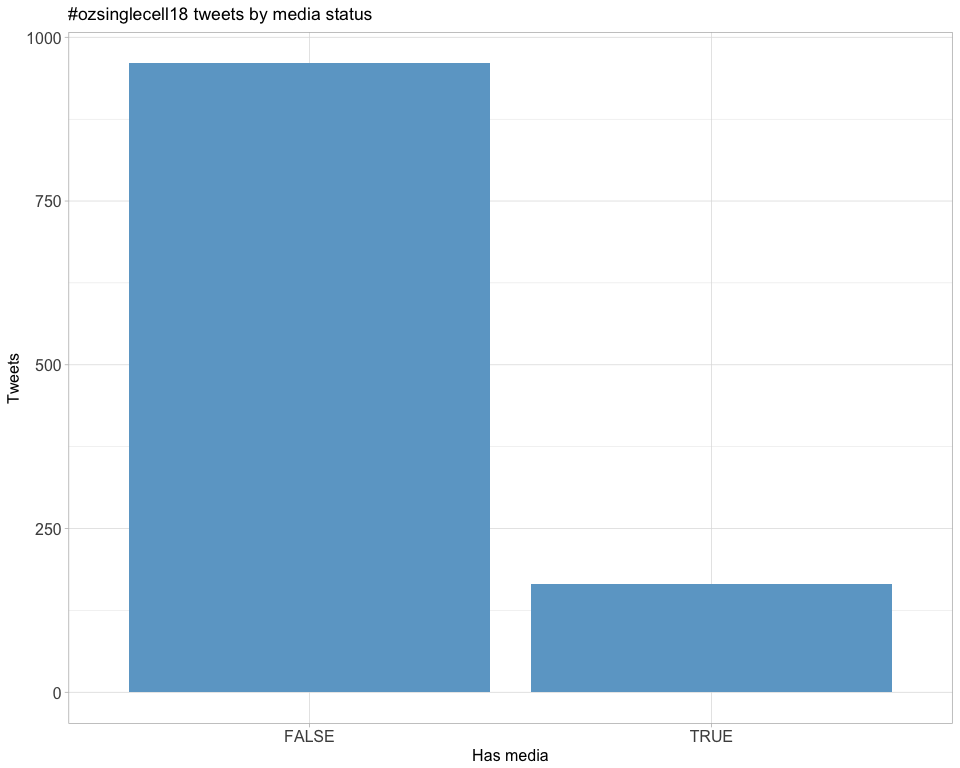

# Introduction
An analysis of tweets from the Oz Single Cells 2018 conference.
1125 tweets were collected using the `rtweet` R package:

# Timeline

## Tweets by day

## Tweets by day and time

Filtered for dates July 16-17 2018, Sydney time.

# Users

## Top tweeters

## Top original tweeters

## Top tweeters by day

### Day 1

### Day 1 (no retweets)

### Day 2

### Day 2 (no retweets)

## Sources

# Networks

## Replies

The "replies network", composed from users who reply directly to one another, 
coloured by page rank.

<!---->

## Mentions

The "mentions network", where users mention other users in their tweets.

<!---->

# Retweets

## Retweet proportion

## Retweet count

## Top retweets

<table>
 <thead>
  <tr>
   <th style="text-align:left;"> screen_name </th>
   <th style="text-align:left;"> text </th>
   <th style="text-align:right;"> retweet_count </th>
  </tr>
 </thead>
<tbody>
  <tr>
   <td style="text-align:left;"> JP_Garvan </td>
   <td style="text-align:left;"> Interested in a single cell postdoc? My lab is recruiting 4 positions: 
Population genetics at single-cell resolution
Clinical translation of single-cell seq methods
Modeling common disease with stem cells at single-cell resolution
DM me. Pls RT @GarvanInstitute #ozsinglecell18 </td>
   <td style="text-align:right;"> 74 </td>
  </tr>
  <tr>
   <td style="text-align:left;"> AliciaOshlack </td>
   <td style="text-align:left;"> Our new paper: Clustering trees: a visualisation for evaluating clusterings at multiple resolutions, has just been published in @GigaScience. You can hear more from @_lazappi_ at #ozsinglecell18 

https://t.co/EoU5lIri1f https://t.co/3WMBVuCmjl </td>
   <td style="text-align:right;"> 54 </td>
  </tr>
  <tr>
   <td style="text-align:left;"> JP_Garvan </td>
   <td style="text-align:left;"> 1 week to go until Oz Single Cells 2018!! Few registration spots left. Come &amp;amp; hear about the awesome work of @davisjmcc Hanlee Ji, @morris_lab @EvNewell1 @Quan_Nguyen_UQ @jeanyang21 @joshuawkho @Dr_Heather_Lee @Al__Forrest &amp;amp; many others #ozsinglecell18  https://t.co/HEz42QgMX5 </td>
   <td style="text-align:right;"> 15 </td>
  </tr>
  <tr>
   <td style="text-align:left;"> JP_Garvan </td>
   <td style="text-align:left;"> Final program available for Oz Single Cells July 16-17th @ozsinglecells @G_WCentre @GarvanInstitute #ozsinglecell18 https://t.co/UMyjxeZKS7 </td>
   <td style="text-align:right;"> 14 </td>
  </tr>
  <tr>
   <td style="text-align:left;"> _lazappi_ </td>
   <td style="text-align:left;"> If you are a student at #ozsinglecell18 with a computational part to your project come talk to me about @combine_au and the national bioinformatics/comp bio student community. </td>
   <td style="text-align:right;"> 12 </td>
  </tr>
  <tr>
   <td style="text-align:left;"> dgallegoortega </td>
   <td style="text-align:left;"> #ozsinglecell18 awesome repertoire of open-source #scRNASeq tools from the @JP_Garvan lab. https://t.co/eaLIxSOBot </td>
   <td style="text-align:right;"> 11 </td>
  </tr>
  <tr>
   <td style="text-align:left;"> dgallegoortega </td>
   <td style="text-align:left;"> #ozsinglecell18 @GarvanInstitute record of attendance! https://t.co/glW9vrb6d3 </td>
   <td style="text-align:right;"> 10 </td>
  </tr>
  <tr>
   <td style="text-align:left;"> _lazappi_ </td>
   <td style="text-align:left;"> Slides for my #ozsinglecell18 talk this morning https://t.co/lzHAj1JFYS. Catch me today if you want a clustree sticker. https://t.co/Uet2kYFuiS </td>
   <td style="text-align:right;"> 10 </td>
  </tr>
  <tr>
   <td style="text-align:left;"> JP_Garvan </td>
   <td style="text-align:left;"> Pls RT.  Two bioinformatics positions are available in the Garvan-Weizmann Centre for Cellular Genomics at Garvan. Adverts here, but DM me for further info.
https://t.co/BtRDcTu7Qu
https://t.co/4jlcZqL8hC
@GarvanInstitute @G_WCentre #ozsinglecell18 </td>
   <td style="text-align:right;"> 9 </td>
  </tr>
  <tr>
   <td style="text-align:left;"> _lazappi_ </td>
   <td style="text-align:left;"> PhD Scholarships available to work with @jessicacmar on stem cell bioinformatics &amp;amp; computational biology @UQ_News https://t.co/aH47gnEGyu #ozsinglecell18 #binfjobs </td>
   <td style="text-align:right;"> 9 </td>
  </tr>
</tbody>
</table>

# Favourites

## Favourite proportion

## Favourite count

## Top favourites

<table>
 <thead>
  <tr>
   <th style="text-align:left;"> screen_name </th>
   <th style="text-align:left;"> text </th>
   <th style="text-align:right;"> favorite_count </th>
  </tr>
 </thead>
<tbody>
  <tr>
   <td style="text-align:left;"> AliciaOshlack </td>
   <td style="text-align:left;"> Our new paper: Clustering trees: a visualisation for evaluating clusterings at multiple resolutions, has just been published in @GigaScience. You can hear more from @_lazappi_ at #ozsinglecell18 

https://t.co/EoU5lIri1f https://t.co/3WMBVuCmjl </td>
   <td style="text-align:right;"> 116 </td>
  </tr>
  <tr>
   <td style="text-align:left;"> JP_Garvan </td>
   <td style="text-align:left;"> Interested in a single cell postdoc? My lab is recruiting 4 positions: 
Population genetics at single-cell resolution
Clinical translation of single-cell seq methods
Modeling common disease with stem cells at single-cell resolution
DM me. Pls RT @GarvanInstitute #ozsinglecell18 </td>
   <td style="text-align:right;"> 40 </td>
  </tr>
  <tr>
   <td style="text-align:left;"> morris_lab </td>
   <td style="text-align:left;"> Looking forward to my first keynote talk at #ozsinglecell18. Lots of new data to share and excited to hear all the talks! https://t.co/Qgw7kbUbc8 </td>
   <td style="text-align:right;"> 29 </td>
  </tr>
  <tr>
   <td style="text-align:left;"> JP_Garvan </td>
   <td style="text-align:left;"> Getting ready for #ozsinglecell18 @G_WCentre @ozsinglecells @GarvanInstitute https://t.co/uhM2Tuvxe2 </td>
   <td style="text-align:right;"> 28 </td>
  </tr>
  <tr>
   <td style="text-align:left;"> PeteHaitch </td>
   <td style="text-align:left;"> Heading to #ozsinglecell18 to learn how to do my new job that starts today at @WEHI_research. Excited to meet the community in Oz! </td>
   <td style="text-align:right;"> 28 </td>
  </tr>
  <tr>
   <td style="text-align:left;"> dgallegoortega </td>
   <td style="text-align:left;"> #ozsinglecell18 @GarvanInstitute record of attendance! https://t.co/glW9vrb6d3 </td>
   <td style="text-align:right;"> 23 </td>
  </tr>
  <tr>
   <td style="text-align:left;"> FaValdesMora </td>
   <td style="text-align:left;"> #ChriSNE my daughters interpretation of a tSNE plot. If you want to know what is the bee doing to the flower come to my talk today at 3pm #ozsinglecell18 https://t.co/iKyagdRxP5 </td>
   <td style="text-align:right;"> 23 </td>
  </tr>
  <tr>
   <td style="text-align:left;"> AliciaOshlack </td>
   <td style="text-align:left;"> On the plane to Sydney for #ozsinglecell18. Looking forward to all the Australian Single Cell action over the next 2 days. I’ll be tweeting from there. Check out the program here

https://t.co/IokRIUumSP </td>
   <td style="text-align:right;"> 23 </td>
  </tr>
  <tr>
   <td style="text-align:left;"> shalinhnaik </td>
   <td style="text-align:left;"> I have a bet with my RA for a bottle of whisky that Total-seq (CITE-seq) or Ab-seq will take over FACS analyses within 10 years @BDBiosciences @BioLegend #ozsinglecell18 </td>
   <td style="text-align:right;"> 22 </td>
  </tr>
  <tr>
   <td style="text-align:left;"> AndrewL28427684 </td>
   <td style="text-align:left;"> Going for the weird body positioning of a tsne plot. Data from https://t.co/QBUeK7qEPE
#ChriSNE #ozsinglecell18 https://t.co/XZBah0UHhs </td>
   <td style="text-align:right;"> 22 </td>
  </tr>
</tbody>
</table>

# Quotes

## Quote proportion

## Quote count

## Top quotes

<table>
 <thead>
  <tr>
   <th style="text-align:left;"> screen_name </th>
   <th style="text-align:left;"> text </th>
   <th style="text-align:right;"> quote_count </th>
  </tr>
 </thead>
<tbody>
  <tr>
   <td style="text-align:left;"> ozsinglecells </td>
   <td style="text-align:left;"> The place to be! #ozsinglecell18 https://t.co/dy2FUzfPG4 </td>
   <td style="text-align:right;"> 2 </td>
  </tr>
  <tr>
   <td style="text-align:left;"> francaronchese </td>
   <td style="text-align:left;"> Good to have a strong @Malaghan_Inst representation at #ozsinglecell18, it is promising to be a great conference! https://t.co/amd4w9Vx0r </td>
   <td style="text-align:right;"> 2 </td>
  </tr>
  <tr>
   <td style="text-align:left;"> ozsinglecells </td>
   <td style="text-align:left;"> Woo hoo! Our first #ChriSNE entry #ozsinglecell18 https://t.co/y3ISWVPeZa </td>
   <td style="text-align:right;"> 2 </td>
  </tr>
  <tr>
   <td style="text-align:left;"> mincle </td>
   <td style="text-align:left;"> Endorsed 15/10 dubious clustering #teamwork #darkarts #ozsinglecell18 https://t.co/FNCeCSckIc </td>
   <td style="text-align:right;"> 2 </td>
  </tr>
  <tr>
   <td style="text-align:left;"> shalinhnaik </td>
   <td style="text-align:left;"> #ChriSNE gold #ozsinglecell18 https://t.co/jQelmJaDYi </td>
   <td style="text-align:right;"> 2 </td>
  </tr>
  <tr>
   <td style="text-align:left;"> mincle </td>
   <td style="text-align:left;"> Endorse 15/10 Clustering meets urban decay #truthinart #closetohome #ozsinglecell18 https://t.co/VvAxWXSiIi </td>
   <td style="text-align:right;"> 2 </td>
  </tr>
</tbody>
</table>

# Media

## Media count

## Top media

<table>
 <thead>
  <tr>
   <th style="text-align:left;"> screen_name </th>
   <th style="text-align:left;"> text </th>
   <th style="text-align:right;"> favorite_count </th>
  </tr>
 </thead>
<tbody>
  <tr>
   <td style="text-align:left;"> AliciaOshlack </td>
   <td style="text-align:left;"> Our new paper: Clustering trees: a visualisation for evaluating clusterings at multiple resolutions, has just been published in @GigaScience. You can hear more from @_lazappi_ at #ozsinglecell18 

https://t.co/EoU5lIri1f https://t.co/3WMBVuCmjl </td>
   <td style="text-align:right;"> 116 </td>
  </tr>
  <tr>
   <td style="text-align:left;"> JP_Garvan </td>
   <td style="text-align:left;"> Getting ready for #ozsinglecell18 @G_WCentre @ozsinglecells @GarvanInstitute https://t.co/uhM2Tuvxe2 </td>
   <td style="text-align:right;"> 28 </td>
  </tr>
  <tr>
   <td style="text-align:left;"> dgallegoortega </td>
   <td style="text-align:left;"> #ozsinglecell18 @GarvanInstitute record of attendance! https://t.co/glW9vrb6d3 </td>
   <td style="text-align:right;"> 23 </td>
  </tr>
  <tr>
   <td style="text-align:left;"> FaValdesMora </td>
   <td style="text-align:left;"> #ChriSNE my daughters interpretation of a tSNE plot. If you want to know what is the bee doing to the flower come to my talk today at 3pm #ozsinglecell18 https://t.co/iKyagdRxP5 </td>
   <td style="text-align:right;"> 23 </td>
  </tr>
  <tr>
   <td style="text-align:left;"> AndrewL28427684 </td>
   <td style="text-align:left;"> Going for the weird body positioning of a tsne plot. Data from https://t.co/QBUeK7qEPE
#ChriSNE #ozsinglecell18 https://t.co/XZBah0UHhs </td>
   <td style="text-align:right;"> 22 </td>
  </tr>
  <tr>
   <td style="text-align:left;"> dgallegoortega </td>
   <td style="text-align:left;"> #ozsinglecell18 awesome repertoire of open-source #scRNASeq tools from the @JP_Garvan lab. https://t.co/eaLIxSOBot </td>
   <td style="text-align:right;"> 21 </td>
  </tr>
  <tr>
   <td style="text-align:left;"> JP_Garvan </td>
   <td style="text-align:left;"> Miles scaring the shit out of non-immunologists #ozsinglecell18 https://t.co/two4ldpNGJ </td>
   <td style="text-align:right;"> 19 </td>
  </tr>
  <tr>
   <td style="text-align:left;"> davisjmcc </td>
   <td style="text-align:left;"> Many thx to #ozsinglecell18 organisers for meeting my demands and flying me to Sydney business class 🙏 #diva. Ok, jokes, I was lucky to be upgraded (thx @emirates), which means I'm in Sydney much fresher than otherwise, listening to Radio Birdman and getting pumped for tomorrow https://t.co/dxAXf3wSFY </td>
   <td style="text-align:right;"> 15 </td>
  </tr>
  <tr>
   <td style="text-align:left;"> shazanfar </td>
   <td style="text-align:left;"> What happens when you host a conference right outside a messina 😅😋 #ozsinglecell18 https://t.co/4PgxLALxis </td>
   <td style="text-align:right;"> 15 </td>
  </tr>
  <tr>
   <td style="text-align:left;"> JP_Garvan </td>
   <td style="text-align:left;"> Samantha Morris kicking off #ozsinglecell18 with single cell resolution lineage tracing of cell gate reprogramming @morris_lab @ozsinglecells https://t.co/Qx0pcljvBG </td>
   <td style="text-align:right;"> 15 </td>
  </tr>
</tbody>
</table>

### Most liked media image

# Tweet text

The top 100 words used 3 or more times.

